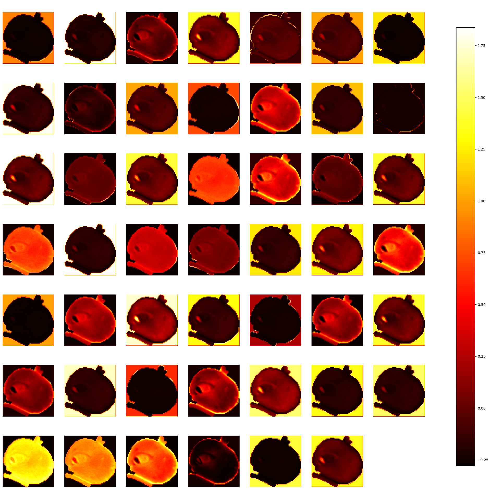

# EN 250 Final Project

Detect malaria using NIH parasitized cell slide image dataset and the Google EfficientNet architecture.

# Directories

| Directory               | Description                                                                                                                |
| ----------------------- | -------------------------------------------------------------------------------------------------------------------------- |
| `results`               | Results of training the model on an AWS EC2 "p3.2xlarge" instance.                                                         |
| `results/by_batch_size` | Graphs of accuracy and loss for each minibatch size tested, as well as two graphs that contain all those results combined. |
| `results/final_model`   | The trained, full model.                                                                                                   |

The model included in the results is not the divergent model used in the paper and presentation, instead it is a model which properly converged. The solution to the issue of divergence in the original model was the use of image preprocessing and a lack of available data. Data augmentation and removal of image preprocessing resolved the convergence issues to produce a model which achieves 95.8% accuracy with a categorical cross-entropy loss of 0.128.

# Setup

1. Install Anaconda (https://www.anaconda.com/products/individual)
2. `conda create --name tfgpu tensorflow-gpu`
3. `conda activate tfgpu`
4. `pip install -U git+https://github.com/qubvel/efficientnet`
5. `pip install -U scikit-learn`
6. Navigate to be inside the repository directory
7. `wget ftp://lhcftp.nlm.nih.gov/Open-Access-Datasets/Malaria/cell_images.zip`
8. `unzip cell_images.zip`
9. `mv cell_images/ data/`
10. `python malaria.py`

